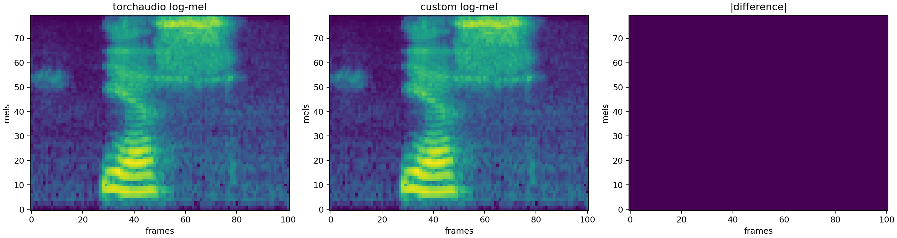
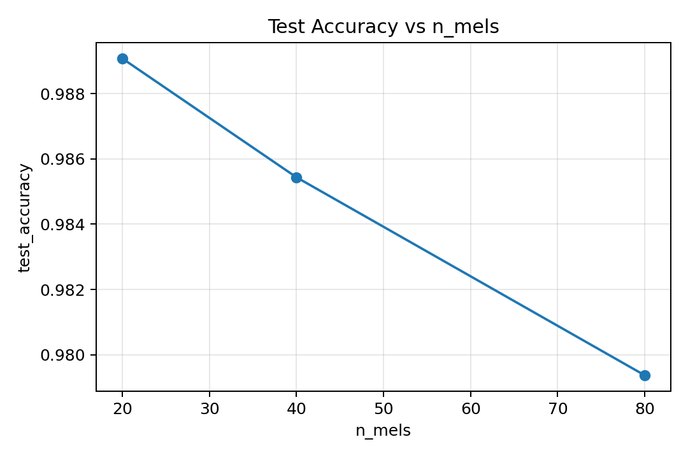
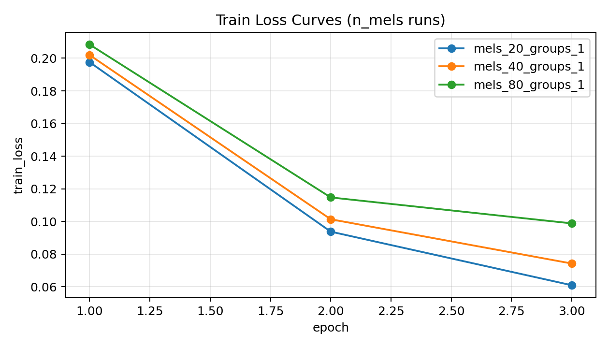
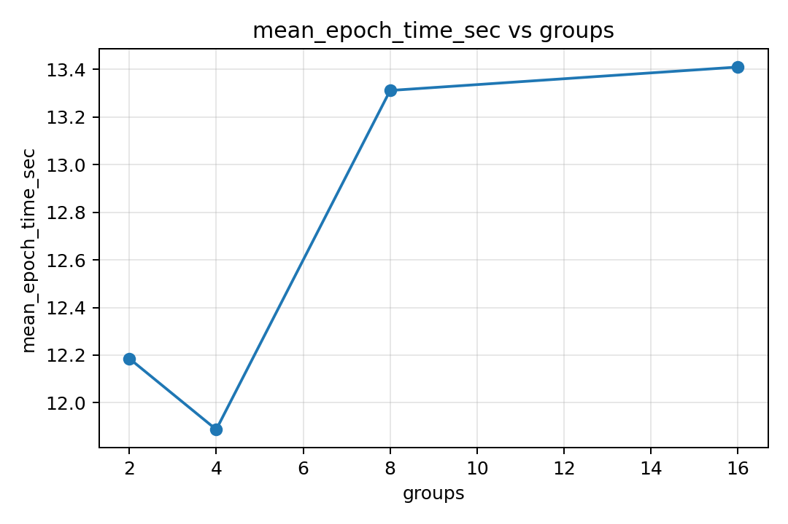
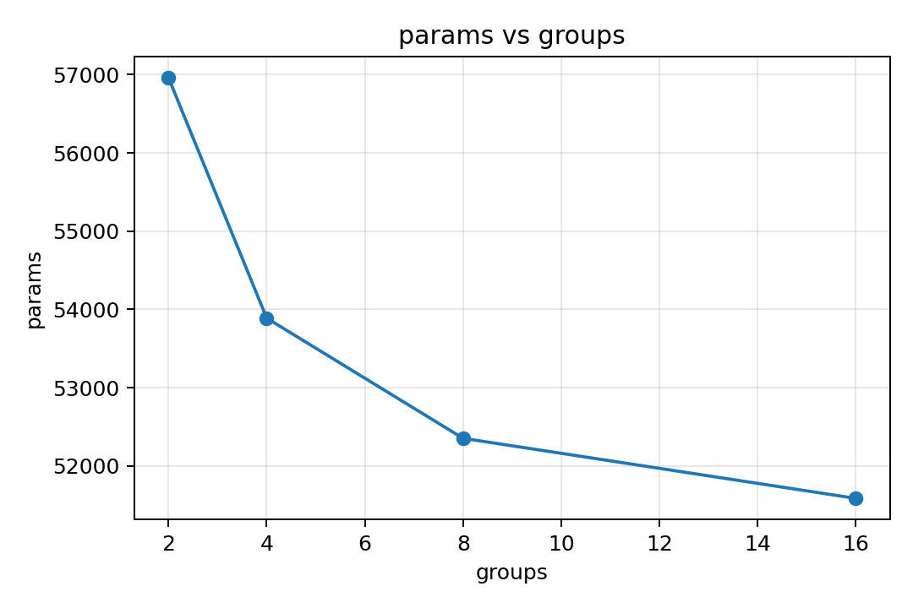
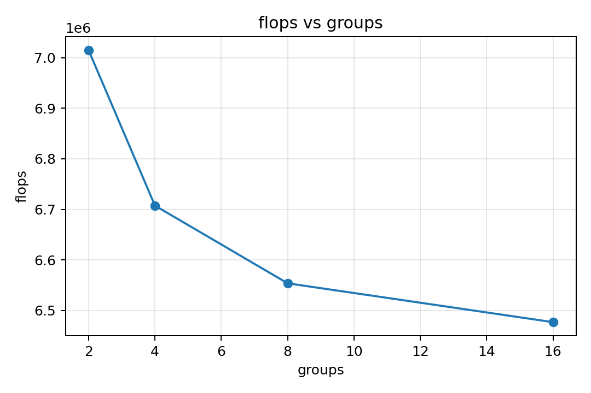
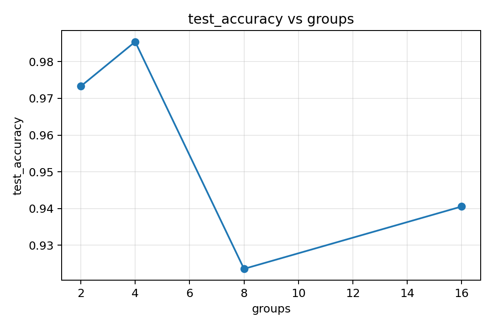

# Assignment 1 Report

## 1. LogMelFilterBanks implementation
Implemented in `melbanks.py`:
- Hann window (`torch.hann_window`)
- STFT with power spectrum (`power=2.0`)
- Mel projection via `torchaudio.functional.melscale_fbanks`
- Output as `torch.log(mel_spec + 1e-6)`

## 2. Validation vs torchaudio
Validation script:
```bash
python3 scripts/check_logmel.py --wav-path data/SpeechCommands/speech_commands_v0.02/yes/0a7c2a8d_nohash_0.wav --output-plot artifacts/full/plots/logmel_comparison_real_wav.png
```

Observed:
- shape match: `(1, 80, 101)`
- `torch.allclose(...) = True`
- max absolute diff = `0.0`

Plots:
- `../artifacts/plots/logmel_comparison.png`
- `../artifacts/full/plots/logmel_comparison_real_wav.png`



## 3. Binary yes/no pipeline
- Dataset: `torchaudio.datasets.SPEECHCOMMANDS`
- Classes used: `yes`, `no`
- Splits: default `training / validation / testing`
- Audio preprocessing: mono, resample to 16 kHz, pad/truncate to 16000 samples

## 4. Model and complexity
Model: `SpeechYesNoCNN` (Conv1d-based, with LogMel features).

Parameter budget check:
- all trained variants are `< 100K` parameters
- range observed: `43,905` to `63,105` params

FLOPs are measured via forward hooks (Conv1d + Linear) and written to `summary.csv`.

## 5. Training setup
- Optimizer: Adam
- Loss: BCEWithLogitsLoss
- Epochs per run: 3
- Logged per epoch:
  - `train_loss`
  - `val_accuracy`
  - `epoch_time_sec`
- Test metric:
  - `test_accuracy`

Artifacts:
- histories: `../artifacts/full/logs/*_history.csv`
- checkpoints: `../artifacts/full/checkpoints/*.pt`
- summary: `../artifacts/full/summary.csv`

## 6. n_mels experiments

| run | n_mels | test accuracy | best val accuracy | mean epoch time (s) |
|---|---:|---:|---:|---:|
| mels_20_groups_1 | 20 | 0.9891 | 0.9788 | 17.400 |
| mels_40_groups_1 | 40 | 0.9854 | 0.9851 | 17.226 |
| mels_80_groups_1 | 80 | 0.9794 | 0.9751 | 13.945 |

Plots:
- `../artifacts/full/plots/n_mels_vs_test_accuracy.png`
- `../artifacts/full/plots/train_loss_n_mels_runs.png`




Observation:
- Best test accuracy in this setup: `n_mels=20`.
- `n_mels=80` was fastest by epoch, but had lower test accuracy than 20/40.

## 7. groups experiments (baseline n_mels=80)

| run | groups | params | FLOPs | test accuracy | best val accuracy | mean epoch time (s) |
|---|---:|---:|---:|---:|---:|---:|
| mels_80_groups_2 | 2 | 56,961 | 7,014,656 | 0.9733 | 0.9813 | 12.186 |
| mels_80_groups_4 | 4 | 53,889 | 6,707,456 | 0.9854 | 0.9851 | 11.887 |
| mels_80_groups_8 | 8 | 52,353 | 6,553,856 | 0.9235 | 0.9751 | 13.312 |
| mels_80_groups_16 | 16 | 51,585 | 6,477,056 | 0.9405 | 0.9676 | 13.410 |

Plots:
- `../artifacts/full/plots/groups_vs_mean_epoch_time_sec.png`
- `../artifacts/full/plots/groups_vs_params.png`
- `../artifacts/full/plots/groups_vs_flops.png`
- `../artifacts/full/plots/groups_vs_test_accuracy.png`






Observation:
- Increasing `groups` reduces params/FLOPs.
- Best quality among tested groups is `groups=4`.
- Very high grouping (`8`, `16`) reduced quality noticeably in this setup.

## 8. Final conclusions
- Custom `LogMelFilterBanks` is numerically equivalent to torchaudio MelSpectrogram + log.
- Conv1d binary classifier meets `<100K` params constraint for all tested configs.
- For this 3-epoch setup:
  - best overall test accuracy: `mels_20_groups_1` (`0.9891`)
  - best grouped-conv trade-off: `mels_80_groups_4` (`0.9854`)
- Suggested baseline for next stage:
  - `n_mels=20, groups=1` if maximizing accuracy
  - `n_mels=80, groups=4` if prioritizing grouped-conv efficiency with strong quality
